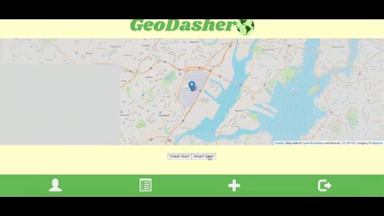

# GeoDasher
> A location-based game that allows you to map out routes and compete
head-to-head with other players for the fastest times.

GeoDasher is a game, a curious cross between geocaching and "The Amazing Race".
In the game, a player can create a route that other users can race to compete
for the fastest time completed on that route. We're in an intermission with development at the
moment, but in the end I'd like to convert the game to a mobile app. 



## Installation
> This README applies to both the frontend and backend for this application.
In order to develop or view it on your computer you will need both parts.

PART 1: BACKEND

OS X & Linux:

1) First, make a new directory to hold both the backend and the frontend of this
project.

2) Now, navigate to this page (https://github.com/campbelllssoup/geo-dasher-api)
copy the SSH link, and run the following command in the project folder:

```sh
git clone <SSH key>
```

3) Next, go into the project directory (geo-dasher-api) & run the following command
(if using Homebrew):

```sh
bundle
```

** If you're not using Homebrew, I would highly suggest installing it. Here is a
great article that guides you step-by-step on how to install Homebrew on your
computer. (http://osxdaily.com/2018/03/07/how-install-homebrew-mac-os/) **

4) After you've done that, you need to migrate the database and seed the database.
To do this, first make sure that you have installed postgres and start the program
on your computer. (If you don't have postgres installed on your computer here's
a link on how to do so: http://www.postgresqltutorial.com/install-postgresql/)


5) After you have Postgres running, run the following commands while inside of
the project's head directory.

```sh
rails db:create
rails db:migrate
rails db:seed
```

6) Now that you've installed all the necessary dependencies and have the database
up and running - run the following
command to start the server for the backend:

```sh
rails s -p=3005
```

7) Now that you have the server up and running, once you have the frontend running
you will be able to access the information from the database that belongs with
the app.


PART 2: FRONTEND

OS X & Linux:

1) Open a new tab and make sure that you are inside of the directory that holds
geo-dasher-api and not inside of geo-dasher-api itself.

2) Now, navigate to this page (https://github.com/campbelllssoup/geo-dasher)
copy the SSH link, and run the following command in the project folder:

```sh
git clone <SSH key>
```

3) Next, go into the project directory (geo-dasher) & run the following command
(if using npm):

```sh
npm install
```

4) Be sure that your postgres database is up and running. Now that you've installed
all the necessary dependencies and have the database up and running - run the
following command to start the server for the frontend:

```sh
npm start
```

5) Now navigate to http://localhost:3000 in order to view the site.


## Meta

Written By:

Matthew Campbell – matjocampbell@gmail.com

[Github](https://github.com/campbelllssoup)
